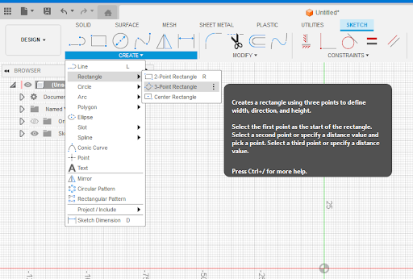
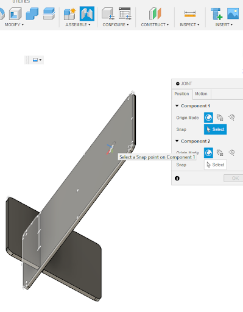

# Fusion 360 for Laser Cutting – Interlocking Phone Stand Activity 
1. Launch Fusion 360 and get familiar with how to move around:
- **Hold down** the **mouse wheel** and **drag** to **move**.
- **Press** the **shift key** while **holding down** the **mouse wheel** to **rotate**.
- **Scroll** the **mouse wheel** to **zoom** in and out. 
- **Click** to **select**.
- **Press Esc** to **clear a selection**.

2. Create the basic shape of the phone stand: 
- Start a new sketch by clicking **Create Sketch** . It will prompt you to select a plane. A good practice is to select the plane from which the object would be viewed in real life.
- Select the **3-Point Rectangle tool**, this tool can be found under the create header, then under the rectangle option. 
- Place the first corner at the **origin** at the middle of the screen. **Click** to place a second corner somewhere above and right of the origin, then **drag the rectangle upwards and 
 click to make your rectangle**. This will be the back of your phone stand. 
- Click the **Esc key** to exit the 3-Point Rectangle tool.
- Try moving the sides of the rectangle around by **selecting and dragging the blue edges of the rectangle**.
- Select the **Sketch Dimension** tool .  **Click** on the short end of the rectangle, and enter **the thickness of your material to be laser cut** (in this case, 3mm). Move your mouse slightly above the line on the long side of the rectangle and click again. **Enter the height of your phone plus about 20mm** as the dimension (in this case, 160mm). 
- Click the **Esc key** to exit the Dimension tool.
- **Repeat the steps to create a 3-Point Rectangle.** This time place the first corner on the red horizontal line in the center of the screen and to the right of your first rectangle. This will be the leg of your phone stand. 
- Place the second corner above and right from the first corner. Then **drag the rectangle upwards and towards the left** until you reach the **green vertical line**.
- Click the **Esc key** to exit the 3-Point Rectangle tool. 
- Select the **Sketch Dimension tool** . **Click** on the short end of the rectangle, **enter the thickness of your material to be laser cut (in this case, 3mm)**. Move your mouse slightly above the line on the long side of the rectangle and **click again. Enter the 87 mm** as the dimension.
- Still in the Dimension tool, **click** on the bottom long side of the sketch for your back piece, and then **click** on the top long side of your leg piece. This will show you the angle between the two sides. **Enter 90 as the dimension**.
- **Click** on the top long side of the back piece, then **click** on the top corner of the leg piece (on the left of your shape), **make the dimension 30mm**.
- **Click** on the top long side of the leg piece and then **click** on the origin point, **make the dimension 25mm**.
- Click the **Esc key** to exit the Dimension tool.
- Optional: **Click and drag up** the bottom right corner of your leg piece, so that the corner is sitting on the weight of the red line in the center of the screen. Doing this will allow you to see the silhouette of your phone stand in its final orientation. 
- **Click Finish Sketch** .
- Your sketch should look like the image on the right. 
  
3. Extrude the pieces from your sketch:
- Click on the **SOLID** tab at the top of the screen. Click on the **Extrude** feature .
- **Select** the interior faces of the 3 shapes that make up the back piece from your sketch. 
- In the Extrude pop-up box, **enter 80mm as the distance**. **Change** the Operation to **New Component**. **Click OK**.
- In the left browsing panel, you can see that a new component has been created. **Right click** on the title of the component and **choose “rename”. Rename** the component as “Back”. 
- Try rotating the part to view it in 3D by holding down the shift key and the mouse wheel. 
- Ensure the sketch of your phone stand is visible. If you do not see the outline of your back and leg pieces (in light blue), the sketch is not visible.  To make the sketch visible, **click on the eye icon** next to the folder named ‘Sketches’ on the left browsing panel. You should now see your sketch in light blue. 
- Click on the **Extrude tool** . **Select the small square** where the two pieces of your phone stand will intersect.
- In the Extrude pop-up box, **enter 50mm as the distance**, and make sure that the Operation is set to **Cut**. *Depending on the orientation of your model, this might result in an error ‘No target body found to cut or intersect!’, if this is the case, add a negative in front of your distance.* **Click OK**. 
- **Click** on the **Extrude** icon . Select the 3 shapes that make up the second rectangle from your sketch.
- In the Extrude pop-up box, **enter 80mm as the distance**. **Change the Operation to New Component. Click OK.**
- Once again, in the left browsing panel, you can see that a new component has been created. **Right click** on the title of the component and **choose “rename”. Rename** the component as “Leg”.
- **Click** on the largest faces of the “Leg” and click on the **Combine** tool . Then select the “Back” rectangle as the “Tool Bodies”. **Change the operation to Cut**, and make sure that **Keep Tools** is checked. In the Combine pop-up box, **click OK**. 
- Now both parts have a cut where they will slide perfectly into each other. 

4. Create fillets: 
- To make rounded edges, we will apply fillets to our parts.
- First, click on the **Fillet tool**  and select one edge of your parts (you want to fillet the corners of each of your parts).  **Enter 5mm as the radius value.** The change is reflected in the 3D model. Change the number as needed to create your desired look. In the Fillet pop-up box, **click on OK. Repeat this step for all 8 corners** of the 2 pieces that make up your phone stand. *You can select multiple corners and apply the fillet to all of them at once if this is easier for you* 
- From the left browsing panel, **turn off the visibility of one of your parts** by clicking on the eye icon next to the component’s name, and Zoom to the area where there is a cut to allow the pieces to join. **Click on the Fillet tool   and click on the edges of the cut** (these should be the short lines on the side of your part). **Apply a fillet of 0.5mm.** In the Fillet pop-up box, **click on OK.**

- **Repeat** the previous step with the other part of your phone stand.    Applying this fillet is helpful to facilitate the joint of both parts once they are laser cut. Your completed stand should look like the image on the right:

5. Lay pieces flat:
- **Click on Joint** , then **select the face of one of your parts as Component 1.** 
- **Make visible the origin** in the left browsing panel by clicking on the eye icon next to the folder titled ‘Origin’.
- 
- **Choose the Origin point as the snap point for Component 2** and **select Ok** in the Joint pop-up box. Your part will now rotate to be flat relative to the origin point. 
- **Repeat** this process for the second part of your model by:
    - **Click on Joint** , then **click on the face of your part as Component 1**.
    - **Choose the origin point as the snap for Component 2** in the Joint pop-up box. 
    - **Use the gray arrows to move the piece** to ensure that both parts are not overlapped. *The second part can be moved in any direction, however, make sure to keep an offset Z of 0 so that both parts remain on the same plane.
    - **Click OK** in the Joint pop-up box. 
      

6. Export files for laser cutting:
- **Rotate** your view to see the top face of your piece.
- **Click on Create Sketch**  and **select the face of one of your parts as the plane.**
- **Click on Finish Sketch.** 
- **Repeat** for your other part.
- **Right-click on your sketch from the left browsing panel.** Choose **Save as a DXF**. Name your design and save it on your computer. 

7. Importing DXF files into Inkscape:
- **Open Inkscape**. 
- **Click on the Import button** and select your files. **Click OK** on both pop-up boxes.
- **Move the pieces as needed** and make any design changes you would like to add.  If you want any parts of the design engraved, rather than cut, make sure to change the colour of the stroke and fill accordingly. *Red stroke is standard for cut, and Black fill or stroke is typical for engraving. * Additional design elements can be added at this time to your files as well.
- **Save the file as an SVG**.

Congratulations, your file is ready for laser cutting and can be uploaded to the DSC print now web page. 

[NEXT STEP: Earn a Workshop Badge](informal-credentials.html){: .btn .btn-blue }  
[OPTIONAL: Adding text](1c-adding-text.html){: .btn .btn-blue }
