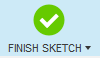
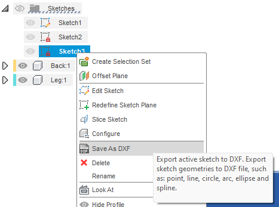
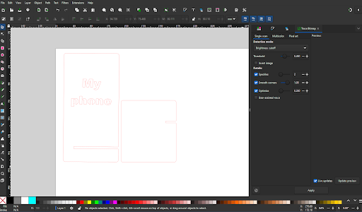

# Adding text (or designs) to parts in Fusion 360 **I suggest retiring this page as the stencil activity covers something quite similar but in a way less complex manner**

You will need to start with a flat piece to add text or other designs to your laser-cut parts in Fusion 360. If you do not have one, start by doing activity 1b to create an interlocking phone stand. 

1. Create your sketch
   - **Click Create Sketch** and select the face where you want to have your design or text.
   - **Click on the Create** drop down list, and then **Text**. Insert a text frame in the desired location. Once the text frame is defined, the Text pop-up box will expand. Insert your text in the Text box and adjust your font, typeface, height and alignment, to your liking. Click OK on the Text pop-up box.
   - Click Finish Sketch.
   
2. Extrude your design
   
   - **Click Extrude** and **select the text** you just added. Make the distance a larger distance than the thickness of your material (in this case, dimension -5mm). Make sure that Operation is set to Cut. **The distance may be a positive or negative value based on your model, if you get an error saying that there is no material found to be cut, add or remove the “-” sign.**
   - **Click OK** on the Extrude pop-up box.
   - If your design is already ready for laser cutting (aka does not have parts that are not connected to the main design or if you plan on engraving your design rather than doing a cut, you can stop here and continue to step ____export DXF_____. If you want to cut through and have areas that would no longer be attached to your part, continue following these instructions.

3. Project your design
   
   - **Click on New Component, select the plane (orange square)** that is most visible when looking at your parts from the top view. **Do not select your parts as the plane! Name the Component** as desired and **click OK** in the New Component pop-up box. 
   - Your parts should now look almost like shadows. 
   - Create a new sketch by clicking on the **Create Sketch button. Select the plane (orange square)** that is most visible when looking at your parts from the top view. **Do not select your parts as the plane!**
   - Once a plane is selected, the Sketch Palette pop-up box will appear. **Click on the Create drop down** list and hover over the **Project / Include button**, select the **Project function.** An additional pop-up box should appear (Project). 
   - **Select the face of your part** with your text as the area to project. **Do not forget to select any parts of the letters that would fall if they were cut through in your final design.** Once a part is selected, the view changes from a light gray to blue, check that the **selection filter is on Bodies**, then **check that all parts of your design are in blue** before **clicking on OK** in the Project pop-up box. Light purple dots will appear on your model and a black outline will be projected. 
   - Zoom to an area that has a part that would fall out if it was cut (examples include the letters p, o, e, a, etc. in most fonts). **Click on the Line tool** and place the 2 points of the line in a way that connects the island (the part of the design that would fall) to the rest of your part. **Repeat this process to make another line.** This will create a space for extra material to remain and hold the island connected to the rest of the part. *Please note that the distance between the 2 lines must be reasonable for your material. A minimum distance of 1mm is recommended.
   - **Click on the escape key.** 
   - If needed, click on the dimension tool and select both lines, choose a dimension of at least 1mm and click OK.
   - To delete the lines of the letter that are between the two new lines you just created, **right-click on the line and click on Break Link. Repeat** this step for each line. 
   - Once all the links are broken, **select the Trim function** and **click on each of these lines to remove them.** 
   - **Repeat** these steps for all the islands found in your text or design. 
   - **Click on the Esc key** once all the bridges are created. Now, when you hover over your part, you should see in blue that all your elements are bridged to be one solid piece. 
   - In the left browsing panel, **open the sketches folder** for your new component using the triangle. 
   - **Right-click on the sketch and select Save as DXF. Name your design and save it on your computer.** 

4. Export files for laser cutting
   - **Rotate** your view to see the top face of your piece.
   - **Click on Create Sketch**  and **select the face of one of your parts as the plane.**
   - **Click on Finish Sketch.** 
   - **Repeat** for your other part.
   - **Right-click on your sketch from the left browsing panel.** Choose **Save as a DXF**. Name your design and save it on your computer. 

5. Importing DXF files into Inkscape 
   - **Open Inkscape**. 
   - **Click on the Import button** and select your files. **Click OK** on both pop-up boxes.
   - **Move the pieces as needed** and make any design changes you would like to add.  If you want any parts of the design engraved, rather than cut, make sure to change the colour of the stroke and fill accordingly. *Red stroke is standard for cut, and Black fill or stroke is typical for engraving. * Additional design elements can be added at this time to your files as well.
   - **Save the file as an SVG**.

[NEXT STEP: Earn a Workshop Badge](informal-credentials.html){: .btn .btn-blue }
