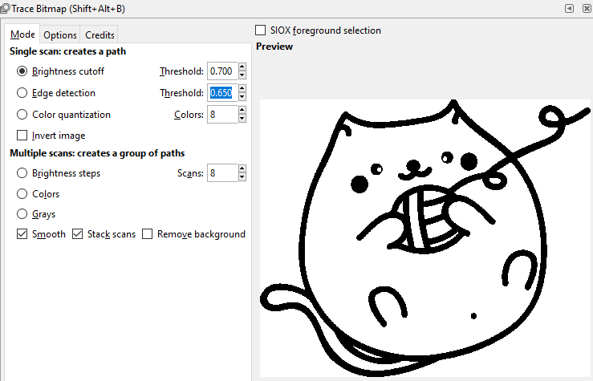
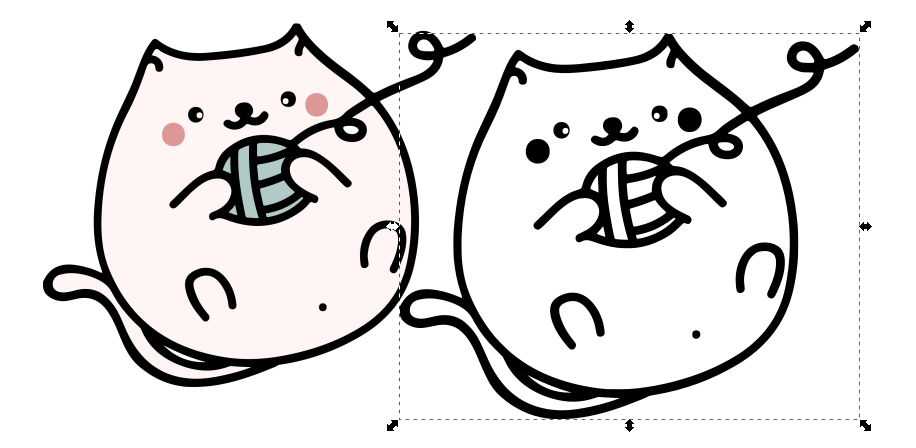

# Engraving in Inkscape
If you and your group have any questions or get stuck as you work through this in-class exercise, please ask the instructor for assistance.  Have fun!

1. If you haven’t already, go to [https://inkscape.org/](https://inkscape.org/release/inkscape-1.2.2/){:target="_blank"}  and download the appropriate version of Inkscape for your computer. If you have Adobe Illustrator or a similar program on your computer and you are familiar with how to use it, you are welcome to follow along using it instead. 

2. Get familiar with how to move around
 - Open Inkscape
 - Left-click is to select
 - Mouse scroll wheel moves the page up and down
 - Shift + mouse scroll wheel moves the page side to side
 - Ctrl + mouse scroll wheel zooms in and out
 - Holding down the mouse scroll wheel drags the page around

3. Find an image you would like to engrave 
 - You can use the cartoon cat image example, or choose your own line art photo from one of the websites below:
 - A cute cartoon cat can be found from pixabay: [pixabay.com/illustrations/cat-cute-kitten-ball-wool-pet-4475583/](https://pixabay.com/illustrations/cat-cute-kitten-ball-wool-pet-4475583/){:target="_blank"} .  
    - [Vectorstock: full colour clip art](https://www.vectorstock.com/){:target="_blank"} 
    - [The noun project: free icon clip art](https://thenounproject.com/){:target="_blank"} 
    - [Biorender: biology clip art](https://biorender.com/){:target="_blank"} 
 - Click on **Free Download** and then choose one of the PNG formats.
 - If you would like to find your own image to engrave, keep in mind that it needs to be high-contrast and free of copyright. For the sake of this exercise choose a **PNG or JPEG** format even though there are plenty of free vector graphic (svg) images out there. 

4. Modify the image in Inkscape 
 - Click File, then Import
 - Find the file that you downloaded and click Open.
    - A box may pop-up asking about import settings. The default settings are fine, click OK. 
 - The image may be very large. If it needs to be scaled down then click on the image and use the arrows to change its size. If you hold **ctrl** while reducing its size then the height to width ratio will remain locked. 
 - With the image still selected, click on the Path menu, then **Trace Bitmap**. 
       
 - Click on the **Update** button or select **Live Preview**. Now you should be able to see a preview of your image. Currently, we’re using the Brightness cutoff mode. Changing the Threshold value will change the amount of brightness needed in order to be converted to the new vector graphic. Try moving the Threshold between 0 to 1 and click on the Update button each time to see the image change.
 - Change the Threshold to **0.7** so that the rosy cheeks of the cat comes through in the live preview. Click on **Update** and then OK. You can now exit out of the Trace Bitmap window. You may need to close the dialogue box by doing the following:
    - **Mac:** Click on the red button in the top left corner of the dialogue box 
    - **Windows:** Click on the red X button in the top right corner of the dialogue box  
 - The new vector graphic has been placed directly on top of the old one. Move the new graphic to a free space on the canvas.
 - Try zooming in to look at both images closely. The newly created image is a vector graphic so the lines always stay crisp while zooming in. 
     
     
 - The Trace Bitmap function creates an object without a stroke whose fill is black. This is ideal for laser engraving and requires no further modifications. Delete the original picture. 

5. Save
 - Click File, then Save As… to save your file. Inkscape’s native file format is .svg which is suitable for laser cutting. 
 - Alternatively, you can copy and paste the graphic into another Inkscape project such as the pencil case from activity 1. 

[NEXT STEP: Design a Pencil Holder using MakerCase](3a-Pencil_Holder.html){: .btn .btn-blue }