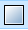

# Workshop Activities

If you and your group have any questions or get stuck as you work through this in-class exercise, please ask the instructor for assistance.  Have fun!

1. If you haven’t already, go to [https://inkscape.org/](https://inkscape.org/release/inkscape-1.2.2/) and download the appropriate version of Inkscape for your computer. If you have Adobe Illustrator or a similar program on your computer and you are familiar with how to use it, you are welcome to follow along using it instead. 

2. Get familiar with how to move around
 - Open Inkscape
 - Left-click is to select
 - Mouse scroll wheel moves the page up and down
 - Shift + mouse scroll wheel moves the page side to side
 - Ctrl + mouse scroll wheel zooms in and out
 - Holding down the mouse scroll wheel drags the page around
    
3. Create the outline of the keychain
 - Click on the Create rectangles and squares () icon  
 - Click and drag somewhere on the canvas to create a rectangle. In the top left corner there’s a toolbar that looks like this:

    
 - Make sure the units are in mm.
 - Change the width (W) and height (H) to 35. 
 - Change the x-radius (Rx) and y-radius (Ry) to 5.
 - Click on the Create circles, ellipses, and arcs () icon. 
 - Somewhere near the square you’ve created, click and drag to make an ellipse.
 - Similar to the rectangle, there’s a toolbar in the top left corner 
 - Make sure the units are in mm.
 - Change the x-radius (Rx) and the y-radius (Ry) to 1.75.
 - Click on the Select and transform objects () icon.   
 - Click and drag around both objects to select them.
 - Click on the Object drop-down menu and select Fill and Stroke. A tool on the right side of the screen should pop-up.  
 - In the Fill tab, change the fill from Flat colour () to No paint (). 
 - Click over to the Stroke paint tab. Select Flat colour. The vector cutting colour is a specific red in the laser software. In the RGB colour selection, Change the red (R) value to 255 and change the green (G) and blue (B) values to 0. 
 - Click over to the Stroke style tab. Change the Width to 0.1 mm. This is to ensure the line is thin enough to show up as a vector line in the laser software. Sometimes if lines are too thick then they’re interpreted as raster objects.
 - Click somewhere on the canvas to unselect the objects. Move the circle to the top left corner of the rectangle. The circle will be the hole for the keychain, so ensure it’s not too close to the edge, or else the small amount of material will be fragile. 

4. Add some text 
   
 - Click on the Create and edit text () icon. 
 - Click somewhere on the canvas and write whatever you want to engrave on the keychain. 
 - Select the text and modify it how you please by using the text editing options at the top of the screen.

 

 - In the Fill and Stroke tool, ensure there is no stroke and the fill is black.
 - Use the Select and transform () tool to move the text inside the rectangle. You can also rotate and scale the text how you please. 

5. Add other shapes. 
 
 - If you want, you can add more shapes using rectangle, circle, or polygon tools on the left side of the screen. 
 - Decide which shapes you want engraved, and which to be cut out. Follow the same Fill and Stroke steps as the rectangle if they are cut. Follow the same Fill and Stroke steps as the text if they are engraved.

6. Save your file
 - Click **File**, then **Save As…** to save your file. Inkscape’s native file format is **.svg** which is suitable for laser cutting. 

# Congratulations - You've designed a keychain for laser cutting!

[NEXT STEP: Prepare an Image for Engraving](3-Engraving.html){: .btn .btn-blue }