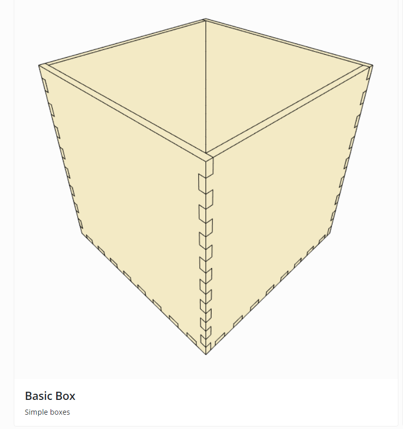
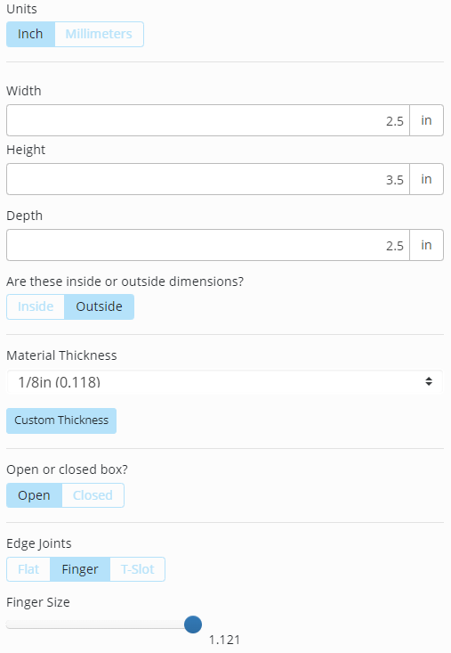
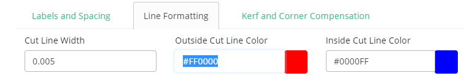
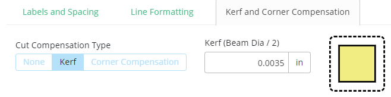

# Design a Pencil Holder Using MakerCase

If you and your group have any questions or get stuck as you work through this in-class exercise, please ask the instructor for assistance.  Have fun!
   
1. Go to [makercase.com](https://www.makercase.com/){:target="_blank"}. This is a website that produces custom box layouts for laser cutting.

2. Select **Basic Box**.

3. Adjust the dimensions of the box.
 
 - On the left side of the screen, change the Box Width to **2.5 inches**.
 - Change the Box Height to **3.5 inches**.
 - Change the Box Depth to **2.5 inches**.
 - Leave these as **Outside** dimensions
 - Leave the material thickness as **⅛”**.
 - Select an **Open** Box.
 - Select the **Finger** joint type. This type of joint is perfect for laser cutting because it allows the pieces to be assembled without glue.
 - Move the Finger Size slider all the way to the right. Larger tabs are easier to assemble than small tabs.

4. Export the files
 - Click on **Download Box Plans**. A window will pop up with the box laid out in 2D. 
 
  

 - Click over to the **Line Formatting** tab. Change the Line Width to **0.2 in** and the Line Color to **#FF0000**. These settings will change the vector lines to be a little thinner than the default and be red. Red is specified as the cut operation in the laser software.
   
   
 - Click on the Kerf tab. Technically, the kerf should be 0.004 in, but it’s easier to assemble the box if not all the kerf is accounted for, so enter 0.0035 in. 
      -  _What is a kerf?  **Kerf** is the width of the cut made by the laser.  You'll need to consider this when designing parts that fit together._  
 - Click on **Download SVG**. This exports the plans as a .svg file which can then be viewed and edited in a browser or in a vector editing software such as Inkscape or Adobe Illustrator.

[NEXT STEP: Modify your box in Inkscape](3b-Modify-svg.html){: .btn .btn-blue }