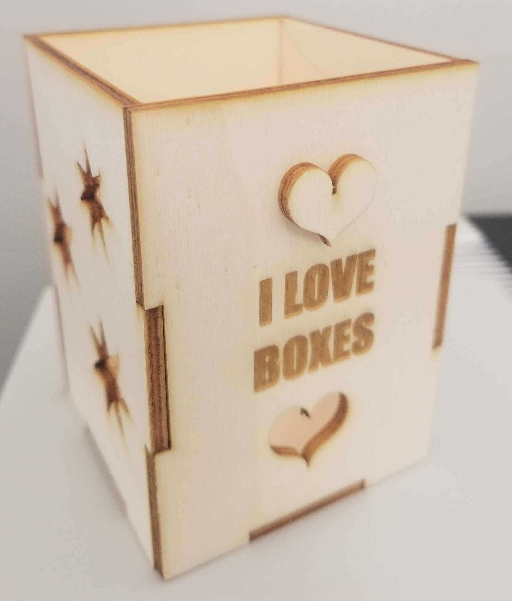
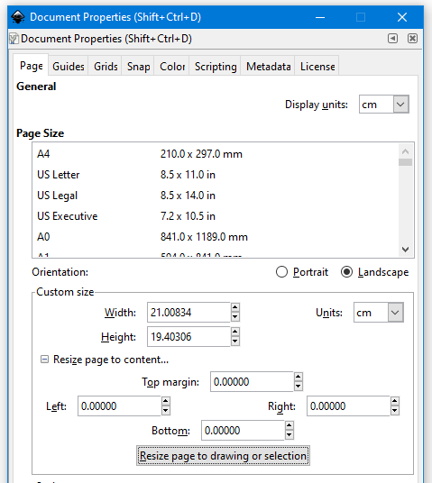
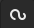
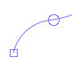
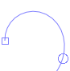
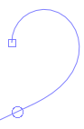
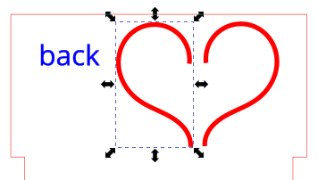
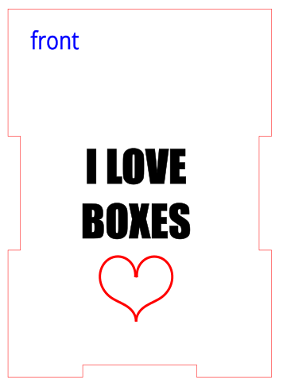
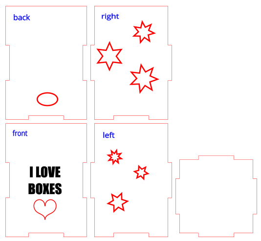

# Modify an svg Using Inkscape

If you and your group have any questions or get stuck as you work through this in-class exercise, please ask the instructor for assistance.  Have fun!

1. If you haven’t already, go to [https://inkscape.org/](https://inkscape.org/release/inkscape-1.2.2/){:target="_blank"} and download the appropriate version of Inkscape for your computer.

2. Open the **box.svg** file you downloaded in Activity 3a in Inkscape.

3. Get familiar with how to move around
 - Left-click is to select
 - Mouse scroll wheel moves the page up and down
 - Shift + mouse scroll wheel moves the page side to side
 - Ctrl + mouse scroll wheel zooms in and out
 - Holding down the mouse scroll wheel drags the page around

4. Change the units from inches to centimeters
 - Hold **Ctrl+Shift+D** to open the document properties window
    - _Note: depending on your version of Inkscape, the window may look slightly different._
 - Change the Front page units and Display units to **cm**
 - Click Resize to make the canvas resize to your box design.  

5. Ungroup the shapes
 - To allow us to move each piece of the box separately we need to ungroup them.
 - Click on the box plans to select them.
 - In the top menu, select **Object > Ungroup**, or hold **Shift+Ctrl+G**. 

6. Edit the text labels
 - Delete the bottom label by selecting it and pressing backspace or delete on your keyboard.
 - Make the other text labels smaller by selecting them and using the corner handles, then click and drag to move them out of the way.
 - Change the fill and stroke color of the labels to blue by selecting them then clicking the blue box at the bottom of the inkscape screen.  Hold shift and click the blue to change the stroke.
    - _Why are we changing the text color?_  The laser cutting software will cut red lines and engrave black/grayscale lines.  By making them blue we can use the labels as a reference when designing our box, but won’t actually engrave them on our box.  If you do want the labels engraved, you can make the text black or request special settings when submitting a laser cut request to the DSC.

7. Add engraving text
 - Click on the Create and edit text  icon.
 - Click somewhere inside the front panel and write whatever you want to engrave.
 - Select the text and modify it how you please by using the text editing options at the top of the screen.
 - In the bottom of the screen you can see Fill and Stroke settings. ensure the fill is **none** or **black** and the stroke is **black**.  
    - To change the fill, select the text then click on the color you want from the bottom.  
    - To change the stroke, select the text, hold the Shift key then click on the color.
 - Use the Select and transform  tool to move the text. You can also rotate and scale the text how you please.  Clicking on an object will swap back and forth between scaling and rotating handles.

8. Convert text to a path
   - Depending on the fonts you use, the laser cutter may not be able to read and engrave the text correctly unless it is converted to a path. For example, if you have a custom Adobe font on your laptop, but the computer connected to the laser cutter does not have the font, then it will substitute a similar font for the Adobe font. The text will look different and will likely be larger or smaller than the Adobe font text. To make sure your text looks the way you expect it to you need to convert the font into a path that the computer connected to the laser cutter can use.  
   - Select your text then from the top menu select **Path > Object to Path** (or Shift+Ctrl+C).

9. Add a hole
 - Click on the Create circles, ellipses, and arcs  icon.
 - Somewhere inside the back box panel, click and drag to make an ellipse.
 - In the top left corner there’s a toolbar that looks like this:
 - Make sure the units are in cm.
 - Change the x-radius (Rx) to **0.8** and the y-radius (Ry) to **0.5**.
 - Click on the Select and transform   icon.
 - Click and drag around both objects to select them. 
 - Click on the Object drop-down menu and select Fill and Stroke. A tool on the right side of the screen should pop-up.
 - In the Fill tab, change the fill from Flat color to No paint .
 - Click over to the Stroke paint tab. Select Flat color. The vector cutting color is a specific red in the laser software. In the RGB color selection, Change the red (R) value to 255 and change the green (G) and blue (B) values to 0.

10. Optional: cut out more shapes
 - Use the create stars and polygons  tool on the left bar to create different star and polygon shapes.
 - Play around with the star and polygon settings in the top menu to see how it changes each shape.

11. Optional: Make a heart
 - Select the **Draw Bezier**  tool on the left sidebar 
 - From the top menu, select the **Create Spiro path** option .
 - Draw the right side of a heart shape, clicking to define each point where the curve changes (hint: you will need to click 4 times in total). 
 
 
 
 
 - **Double-click** to finish making the curve.
 - Choose the select and transform  tool from the left sidebar, then click on the curve you drew.  Copy and paste the curve using **ctrl+c** and **ctrl+v**.
 - Select the new copy, then press H on your keyboard.  This will flip the copy horizontally, making a mirror image. 
 - Drag the left side of the heart to line it up with the right side
 - Group the left and right sides of the heart: 
   - draw a box around both curves (or hold shift and click on both curves) 
   - hold **ctrl+G** (or from the top menu select Object > Group)
 - Drag the heart to position it where you want on the box.  
      
 - If needed, make the heart smaller by using the corner handles.

12. Save
 - Click File, then Save As… to save your file. Inkscape’s native file format is .svg which is suitable for laser cutting.

### Congratulations - you've edited your box in Inkscape!

[NEXT STEP: Making a Character](4a.fun_person.html){: .btn .btn-blue }
