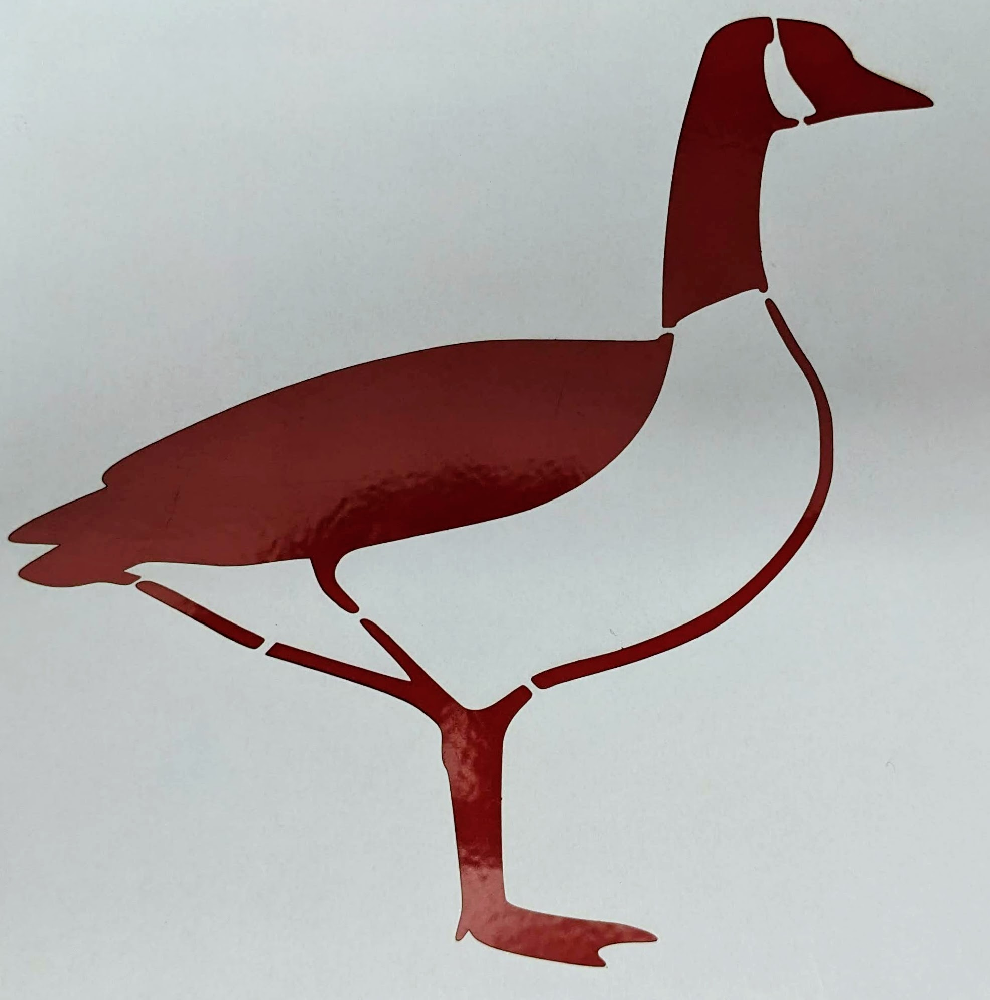
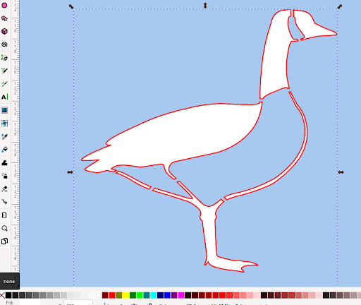

# Make a Stencil with Laser Cutting

If you and your group have any questions or get stuck as you work through this in-class exercise, please ask the instructor for assistance.  Have fun!

- If you haven’t already, go to [https://inkscape.org/](https://inkscape.org/release/inkscape-1.2.2/){:target="_blank"} and download the appropriate version of Inkscape for your computer.

**Is your image good for making a stencil?**

Not all images are created equally, and not all images can be used as-is for stencils. Most images and logos will require some modifications to ensure that detail is not lost and that the final product is strong and durable. 

In this activity, you will learn how to identify what parts of your image or logo might need to be modified to create a stencil. As well as how to create bridges (connection points) between your design and your material. 

Alternatively, it might be possible to modify your design to make it stencil-ready by using the stencil font or simplifying your design. 

Ex 1: 

  
   

Ex 2: 

  
 

Ex 3: 

  
  

In the first example, the logo is unaltered, leading to the robotics text being lost after laser cutting (since there were no bridges connecting these parts to the main material). In the second image, the design is simplified and text uses the stencil font, ensuring that the most crucial information remains part of the final design.  In the third, bridges were created to maintain all elements of the original logo.

_This workshop will teach you how to make a stencil using 2 methods, the first uses TinkerCAD and Inkscape and involves more basic functions, the second uses only Inkscape, but might be better for those with more experience with Vector software or who are interested in gaining such experience._

**First method: Using TinkerCAD and Inkscape**

1. Find an image you would like to turn into a stencil

- You can use the Ostrich image example,    or choose your own line art photo from one of the websites below: 
   - Vectorstock: full colour clip art
   - The noun project: free icon clip art
   - Biorender: biology clipart
- If your image is in the svg. format, it can be imported into TinkerCAD as is. If your image is a PNG or JPEG, follow the instructions in the Workshop Activity 2 to learn how to vectorize your design **using Inkscape**. 

2. Creating a base.

- First, create a new 3D printing project. 
- Next, **drag and drop a cube** from the basic shapes onto the work plane,   and **resize the shape** to be a bit larger than the desired size of your stencil. Make sure to make the **height of the cube 2 mm.** This will serve as the base for your stencil. 

3. Importing your design.

- It's now time to import your .svg file into Inkscape. **Click on Import**  and find the .svg file you want to make into a stencil. Your image will appear and can now be resized to the dimensions you want. Place the image over your base, and change the shape to a **hole**. 
- To create the stencil, **group both shapes together**, using the Group botton. 

4. Adding bridges 

- Notice if any details of your design are floating and need to be attached with bridges to the base. In the case of the ostrich, this includes the wing and tail details, as well as the neck of the bird. 
- To add bridges, **insert a shape on the work plane** by drag and drop. **Modify the dimensions** of the new shape to create a connector between the base and the element that is floating. Make sure to make the **height of the bridges the same height as the base (2mm).** 
- **Add as many connectors as needed** to ensure the structural integrity of your design. Stencils laser cut from flimsy material will require more bridges than those made from materials with more sturdiness.
- **Group your bridges to the main shape**, this is done by **selecting all the pieces and clicking on the group button.** 

5. Exporting your file from TinkerCAD to Inkscape

- Your design is now ready to be exported as an .svg and imported to Inkscape. **Click on Export**, and a pop=up box will appear, **click on .svg** and save your design onto your device.
- **Open Inkscape**, you can now import your design by **clicking on files** and **import**. Find the file you just saved. A box may pop-up asking about import settings. The default settings are fine, **click OK**.
- The page will look blank, however, do not worry.

6. Adjust your design to be ready for laser cutting

- To make your design visible, **click on the blank works space** until you select an item. This is your design imported from TinkerCAD.
- Go under **Fill and Stroke** and **increase the width of the stroke to be at least 1mm.** This will make your design visible.
- **Save** your design. 

_Congratulations, your design is now ready to be laser cut and used as a stencil!_

**Second method: Using Inkscape only**

1. Find an image you would like to turn into a stencil
   
- You can use the Canadian goose image example,    or choose your own line art photo from one of the websites below: 
   - Vectorstock: full colour clip art
   - The noun project: free icon clip art
   - Biorender: biology clipart
- If your image is in the .svg format, it can be imported or copied to Inkscape as is. If your image is a PNG or JPEG, follow the instructions in the Workshop Activity 2 to learn how to vectorize your design. 
- **Click File**, then **click on Import**
- Find the file that you downloaded and **click Open**.
- A box may pop-up asking about import settings. The default settings are fine, **click OK**.
- The image may be very large. If it needs to be scaled down then click on the image and use the arrows to change its size. If you hold ctrl while reducing its size then the height to width ratio will remain locked.

2. Add a red outline to your design
   
- When working with laser cutters, the industry standard is to use red to indicate a cut.
- To add this outline:
   - **Select your design** by clicking on your object.   
   - To add or modify the stroke, use the **options under the  “Fill and Stroke” tab, which is on the right handside of the page (or that can be found under Object -> Fill and Stroke).**   
- **Change the stroke to a solid colour**, and make the stroke **red** and with the **width of 0.01mm**.   

It can sometimes be hard to visualize what parts of your design will consist of the material to be cut, and what parts will be holes where you can apply paint to apply your design. Changing the background of your page can be helpful to better illustrate how your final product will look.
- To change the background, **Click on File**, then **click on Document Properties**
- **Click on the Page icon**, a background colour pop-up box will appear. Use the colour wheel and **select a high contrast colour**. **Exit the pop-up box by clicking on the “X”** and **repeat** this to close the Document Properties pop-up box. 

3. Creating bridges
   
- When making a stencil, it is very important to think about the structural integrity and strength of the final product. Bridges must therefore be created between areas that should not be cut out completely. 
- Elements of your design that are the same colour as your background, need to be connected with bridges.  
- To create a bridge:
- First, use the **eraser tool** to create links between the part you want to connect to the background, and the background.   
   - **Select the eraser tool**
   - Make sure **“Cut from path and shapes”** and **“Break apart cut items”** are selected   
   - **Cut through the desired area**
- Then, **select one of the drawing tools**, both the “Draw Bezier curves and straight lines” and the “Draw freehand lines” tools work well. 
   - If using the “Draw Bezier curves and straight lines” tool: Make sure to have the **“Create a sequence of straight line segments”** mode to create a perfectly straight line.    **Select the first point of your line, then the second. Hit Enter.** Your line will appear and can be moved or modified. 
   - If using the “Draw freehand lines” tool, **click on the starting point of your line and drag the cursor across the desired area.** When released, the line will appear and can then be modified.   
- To ensure that your line will be visible by the laser cutter, **make sure that your line is red and that the width is of 0.01mm.**

4. Creating more bridges
   
- **Repeat** until all the parts that are the same colour as your background have bridges (connection points) to the background.   
- Some areas might need multiple bridges to ensure strength of the final stencil.

5. Changing the fill colour of your design

- Changing the colour of your design to a transparent or white colour ensures that the laser cutter knows to only apply cuts to your project.   This can be done by **selecting your object**, and **clicking on the white square or the gray square with a red X at the bottom of the screen.** 
- It can also be helpful to let us know that you only want cuts to be applied to this project in the Drawing Description box.   

_Congratulations, your design is now ready to be laser cut and used as a stencil!_

[NEXT STEP: Earn a Workshop Badge](informal-credentials.html){: .btn .btn-blue }
