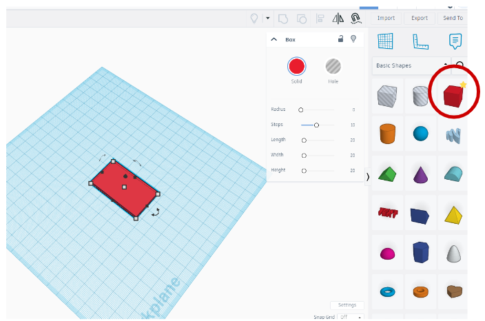

# Make a Standing Silly Character using TinkerCAD and Inkscape

If you and your group have any questions or get stuck as you work through this in-class exercise, please ask the instructor for assistance.  Have fun!

- Go to the TinkerCAD website [https://www.tinkercad.com/](https://www.tinkercad.com/dashboard){:target="_blank"} and login, if you don't have an account, go ahead and create a free account. 
- If you haven’t already, go to [https://inkscape.org/](https://inkscape.org/release/inkscape-1.2.2/){:target="_blank"} and download the appropriate version of Inkscape for your computer.

1. Create the shape of your character

- **Insert a cube** from the basic shapes onto the work plane. 
- You will need to change the dimensions of cube. **Click on the white squares** on the corner of your cube, this will allow you to change the dimensions. **Resize your shape** to be:
  - Width: 30 mm
  - Length: 50 mm
  - Height: 3 mm (thickness of your material)
    
- This is going to be the base shape of your character. 
  
2. Create the tab and group your shape

- **Add another cube** to your work plane, this cube must be **resized** to be: 
  - Width: 4 mm
  - Length: 12 mm
  - Height: 3 mm (thickness of your material)

- Move the second shape to be at the bottom of your character, there should be about 1mm of overlap between both shapes.
- **Select both shapes**, and **click** on the Group button. This will combine both shapes.

3. Create your base

- You will now create the base that will hold your character vertically. 
- **Insert a cylinder** from the basic shapes. **Resize** the shape to be:
  - Width: 30 mm
  - Length: 30 mm
  - Height: 3 mm (thickness of your material)

- It's now time to add the slit that will hold your character. 
- **Add a cube** and select the **hole** function.
- **Resize** the shape to be:
  - Width: : 3 mm (thickness of your material)
  - Length: 11.5 mm (0.5mm less than the length of the tab you created previously)
  - Height: 3 mm

- **Move the rectangle** to the center of the cylinder. Once in place, select both shapes and **group** them together.  

4. Decorate and customize

- **Add pieces to your base shape to customize your character.** You can add pieces to extend outside of the shape or create holes. You can use any additional shapes, including the Scribble tool. Remember, everything needs to be flat and 3 mm in height! 
- Make sure that all your pieces are touching! If one part doesn’t touch, it will fall and your design won’t look like you want it.
- **Group** everything together.

5. Exporting your file from TinkerCAD to Inkscape  

- Your design is now ready to be exported as an .svg and imported to Inkscape. **Click on Export**, and a pop=up box will appear, **click on .svg** and save your design onto your device.
- **Open Inkscape**, you can now import your design by **clicking on files** and **import**. Find the file you just saved. A box may pop-up asking about import settings. The default settings are fine, **click OK**.
- The page will look blank, however, do not worry. 

6. Adjust your design to be ready for laser cutting

- To make your design visible, **click on the blank works space** until you select an item. This is your design imported from TinkerCAD. 
- Go under **Fill and Stroke** and **increase the width of the stroke to be at least 1mm.** This will make your design visible.
- **Save** your design.

_Congratulations, your design is now ready to be laser cut!_

[NEXT STEP: Make a Stencil](4-stencil.html){: .btn .btn-blue }
