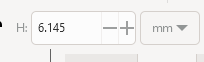

# Adjust Material Width to Match your Material

If you and your group have any questions or get stuck as you work through this in-class exercise, please ask the instructor for assistance.  Have fun!

Occasionally, you might find a model online that was created for a different material width than the material you have available or want to use. In the example below, we will modify a file created for 6mm to 3mm.  

1. **Download & open** [this document for this exercise](Name_plate_6mm.svg){:target="_blank"}.  

2. Select the objects on the page, you will notice that all the elements get selected together. However, in order to modify the file to adjust it for our material width, we need to have all elements separated. 
   
3. **Select your object** and under the Path menu, **click on Break Apart**
- This will create a dotted outline around each element of the design indicating that they can now be modified independently. 

   
4. **Click on the rectangle** in the center of the base. Change the height (H) of the rectangle to 3mm. The rectangle can now be moved to be in the center of the base. 
   
5. **Insert a rectangle**, make the dimensions: 
- W: 24mm
- H: 3mm
  
6. This will be a placeholder to adjust the other element of the nameplate. Overlap this rectangle over the base of the tab of the nameplate. 
   
7. **Click on the nodes tool** and **select the nodes at the bottom of the tab**. These nodes will turn dark blue, indicating that they are selected. Drag the nodes to match the placeholder rectangle. This ensures that the tab will fit correctly with the base. 

_Congratulations, your project is now ready to be laser cut on a 3mm material!_
