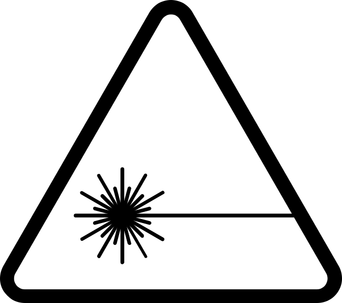

# Introduction to Design for Laser Cutting

- Pre-workshop activities: 15 min 
- Introductory presentation: 10 min
- Hands-on activities: 30-50 min

## What is laser cutting? 

**Laser cutting** is a process for cutting materials to create 2D and 3D designs.  From a digital file (usually .svg or .dxf format), laser cutters use computer controlled high powered lasers to engrave or cut wood, metal, paper and more with high precision.

Laser cutting is a fast and accurate way to engrave objects, make boxes, and more!

## What tools do we use?

[Inkscape](https://inkscape.org/){:target="_blank"} is a free and open source design tool for making and editing vector graphics.  Inkscape uses the standardized svg file format as its main format, which is supported by many other applications including web browsers.

Another design tool is [Photopea](https://www.photopea.com/){:target="_blank"}, a free online image editor.  You can export designs in several formats including .svg. 

This workshop is not an endorsement of Inkscape or Photopea; there are many options for 2D design and other software may be better for different contexts or preferences.

## Learning objectives

At the end of this workshop, you will be able to:

1. Explain to others the pros and cons of laser cutting relative to 3D printing
2. Explain to others acceptable materials for laser cutting and why certain materials are not acceptable
3. Explain what kerf is and how to account for it when designing
4. Describe the difference between vector and raster cuts for engraving
5. Select appropriate 2D or 3D design software for laser applications
6. Find objects and designs online for laser cutting
7. Create and modify 2D designs for engraving
8. Design a 3D object with tab features for joining
9. Export designs to .dxf or .svg file formats
 
[NEXT STEP: Pre-Workshop Activities](pre-workshop.html){: .btn .btn-blue }
